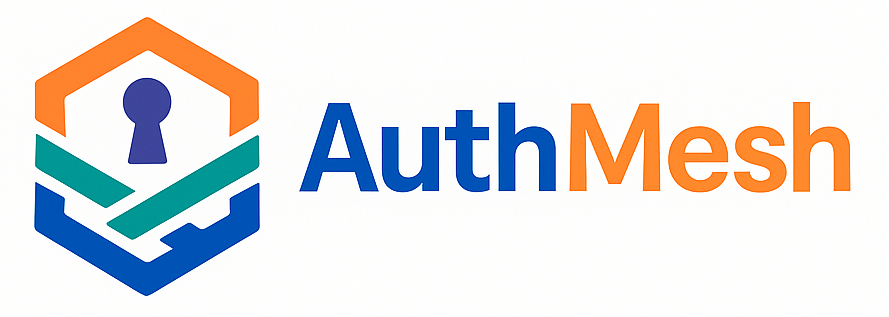

# AuthMesh

Welcome to **AuthMesh**, an open-source initiative dedicated to simplifying secure, scalable, and observable application development. Our mission is to provide modular, production-ready Go libraries and tools for authentication, authorization, metrics, and tracing, empowering developers to build robust systems with ease.

## About Us

AuthMesh is a community-driven organization focused on delivering high-quality, reusable solutions for modern application development. Our flagship project is a Go library that integrates Keycloak-based authentication, role-based access control (RBAC), Prometheus metrics, and distributed tracing, designed for seamless integration into your applications. Built with standard Go practices, our libraries emphasize modularity, testability, and developer experience, complete with hot reloading, containerized development environments, and sample configurations for quick setup.

## Our Projects

The AuthMesh organization hosts repositories that provide tools and libraries to streamline authentication and observability:

- **Core Library**: A modular Go library for Keycloak-based authentication, RBAC, Prometheus metrics, and tracing, with a developer-friendly setup including hot reloading (via `air`), Docker-based development environments, and sample Keycloak realms.
- **Examples and Tools**: Practical examples and utilities to demonstrate usage and extend functionality, making it easy to adopt our libraries in real-world applications.

Explore our repositories to find the tools that best fit your needs.

## Why AuthMesh?

- **Modularity**: Plug-and-play components for authentication, authorization, and observability.
- **Developer Experience**: Simplified setup with hot reloading, containerized environments, and clear documentation.
- **Open Source**: Licensed under Apache 2.0, our projects are free to use, modify, and contribute to.
- **Quality**: Comprehensive unit and end-to-end tests ensure reliability (>80% coverage).
- **Community-Driven**: We welcome contributions from developers worldwide to shape the future of AuthMesh.

## Getting Started

To start using AuthMesh projects:
1. Visit our [GitHub repositories](https://github.com/AuthMesh) to explore available libraries and examples.
2. Follow repository-specific READMEs for setup instructions, including Docker-based development environments and sample configurations.
3. Try our flagship library’s example application to see authentication and metrics in action.

## Contributing

We’re excited to build AuthMesh with the community! To contribute:
- Check out our [repositories](https://github.com/AuthMesh) for open issues and project roadmaps.
- Read our [Contributing Guide](https://github.com/AuthMesh/.github/blob/main/CONTRIBUTING.md) for guidelines on code, testing, and documentation.
- Join the conversation on [GitHub Discussions](https://github.com/orgs/AuthMesh/discussions) to share ideas or ask questions.

## License

All AuthMesh projects are licensed under the [Apache 2.0 License](https://www.apache.org/licenses/LICENSE-2.0), ensuring you can use, modify, and distribute our code freely.

## Contact

Have questions or ideas? Reach out via [GitHub Issues](https://github.com/AuthMesh) or [Discussions](https://github.com/orgs/AuthMesh/discussions). Follow us on [X](https://x.com/AuthMesh) for updates.

Join us in building the future of secure, observable applications with AuthMesh!
